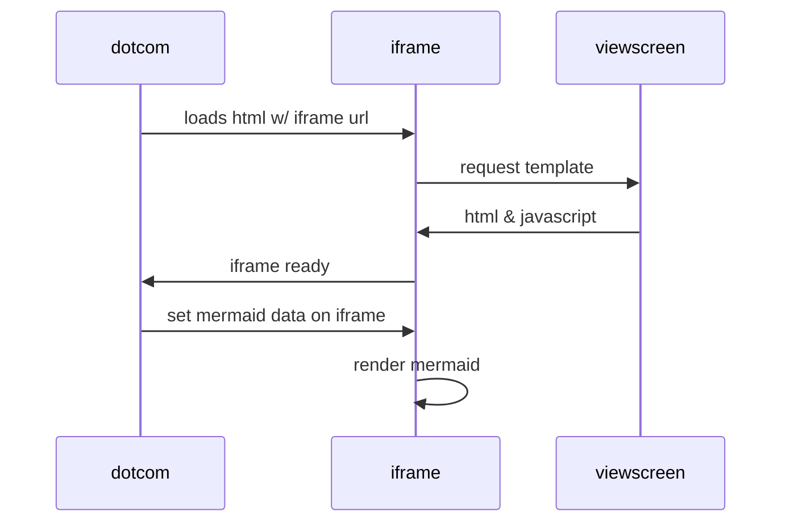

# Alerts

https://docs.github.com/en/get-started/writing-on-github/getting-started-with-writing-and-formatting-on-github/basic-writing-and-formatting-syntax#alerts

~~~markdown
> [!NOTE]
> Useful information that users should know, even when skimming content.
~~~

> [!NOTE]
> Useful information that users should know, even when skimming content.

~~~markdown
> [!TIP]
> Helpful advice for doing things better or more easily.
~~~

> [!TIP]
> Helpful advice for doing things better or more easily.

~~~markdown
> [!IMPORTANT]
> Key information users need to know to achieve their goal.
~~~

> [!IMPORTANT]
> Key information users need to know to achieve their goal.

~~~markdown
> [!WARNING]
> Urgent info that needs immediate user attention to avoid problems.
~~~

> [!WARNING]
> Urgent info that needs immediate user attention to avoid problems.

~~~markdown
> [!CAUTION]
> Advises about risks or negative outcomes of certain actions.
~~~

> [!CAUTION]
> Advises about risks or negative outcomes of certain actions.

# Mermaid diagrams/charts

https://github.blog/2022-02-14-include-diagrams-markdown-files-mermaid/

~~~markdown

~~~

~~~markdown

~~~

# Other useful bits

- [Specifying the theme an image is shown to](https://docs.github.com/en/get-started/writing-on-github/getting-started-with-writing-and-formatting-on-github/basic-writing-and-formatting-syntax#specifying-the-theme-an-image-is-shown-to)
